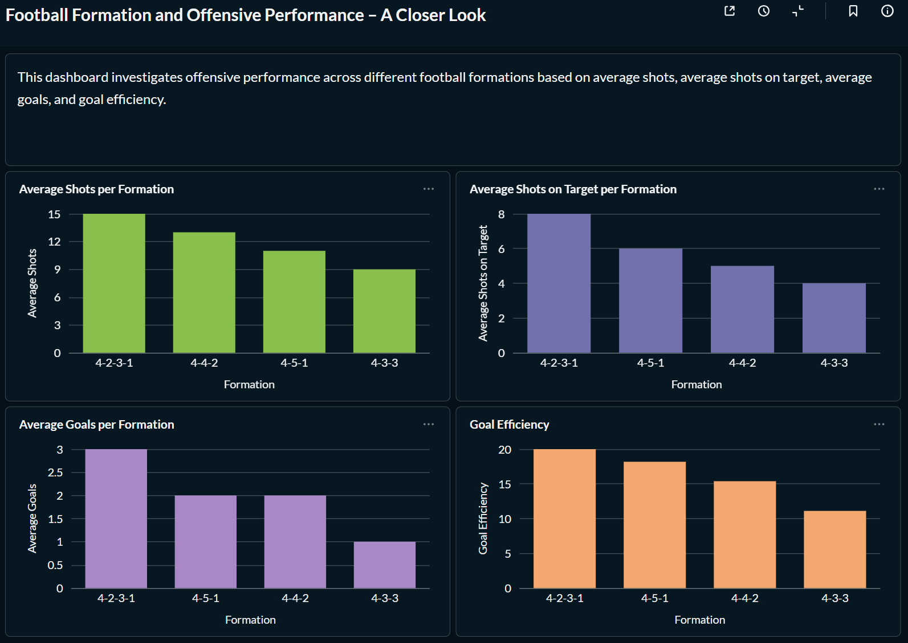

# Football Formation Analytics

## Project Overview

Football clubs continuously make tactical decisions that can influence match performance. One of the most important decisions is the choice of formation, as it affects offensive and defensive behavior, player roles, and overall playing style.

This project investigates the relationship between tactical formations and offensive performance using a relational SQL database. Key performance indicators (KPIs) such as goals, shots, and shots on target are analyzed to identify potential patterns and support data-informed tactical decisions.

The project demonstrates the complete analytical workflow, including database design, SQL-based analysis, interpretation of results, discussion of limitations, and formulation of practical recommendations. While the initial version uses a structured sample dataset, the project is designed to be extended with real match data in future iterations.

The findings are intended to illustrate how SQL-based data analysis can support tactical performance evaluation and decision-making in professional football.

## Research Question

Which tactical formations are associated with the highest offensive performance based on:

* Average Goals
* Average Shots
* Average Shots on Target
* Goal Efficiency?

## Project Goals

1. Investigate the research question through SQL-based data analysis.

2. Analyze offensive KPIs (average goals, average shots, average shots on target, and goal efficiency) across different tactical formations.

3. Demonstrate a complete end-to-end analytics workflow, including database design, data quality checks, SQL analysis, KPI calculation, Metabase visualization, interpretation of results, and discussion of limitations.

4. Present the analytical results in an interactive Metabase dashboard.

5. Provide data-driven insights that can support tactical decision-making.

## Analytics Dashboard

The analytical results are presented in a Metabase dashboard that compares offensive performance across tactical formations using four key metrics:

* Average Shots
* Average Shots on Target
* Average Goals
* Goal Efficiency

The dashboard follows the offensive progression from overall shooting activity to scoring output and conversion efficiency.

## Database Structure

The project uses a relational MariaDB database designed to separate match information, teams, tactical formations, and offensive performance statistics.

The database consists of five main tables:

* `leagues` – stores league information such as name, country, and league level.
* `teams` – stores team information.
* `matches` – stores match dates, seasons, leagues, and participating teams.
* `formations` – stores the tactical formation used by each team in each match.
* `match_stats` – stores offensive performance metrics including goals, shots, and shots on target.

The analysis connects formations with their corresponding match statistics using both `match_id` and `team_id`, ensuring that each formation is associated with the correct team's performance.

## Data Quality

Before performing the KPI analysis, several data quality checks were conducted to ensure that the dataset was suitable for analysis.

The checks included:

* Missing values in the core KPI fields (`goals`, `shots`, and `shots_on_target`).
* Logical inconsistencies, such as more goals than shots or more shots on target than total shots.
* Duplicate team-level match statistics based on the combination of `match_id` and `team_id`.

No issues were identified in the current sample dataset.

## KPI Definitions

The analysis uses four offensive performance metrics:

* **Average Goals** – Average number of goals scored per team-match observation for each formation.
* **Average Shots** – Average number of total shots per team-match observation for each formation.
* **Average Shots on Target** – Average number of shots on target per team-match observation for each formation.
* **Goal Efficiency (%)** – Percentage of total shots that resulted in goals for each formation, calculated as `SUM(goals) / SUM(shots) * 100`.

Goal Efficiency uses `NULLIF(SUM(shots), 0)` in the SQL calculation to prevent division by zero.

## SQL Analysis

The offensive performance analysis was conducted using SQL queries that combine tactical formation data with team-level match statistics.

The analysis covers five main areas:

* Average goals per formation
* Number of matches per formation
* Average shots per formation
* Average shots on target per formation
* Goal efficiency, calculated as the percentage of total shots converted into goals

The queries use relational joins, aggregation functions, grouping, sorting, and defensive handling of potential division-by-zero cases.

The SQL analysis forms the analytical foundation for the KPI visualizations presented in the Metabase dashboard.

## Key Findings

The analysis identified several patterns within the available sample dataset:

* The `4-2-3-1` formation shows the strongest offensive performance across the selected KPIs in the current dataset.
* A higher number of shots does not necessarily correspond to higher goal-scoring efficiency.
* Shots on target provide additional context beyond total shot volume when evaluating offensive performance.
* Goal efficiency highlights differences in how effectively formations convert shooting opportunities into goals.

Due to the limited sample size and the absence of additional contextual variables, these findings should be interpreted as exploratory patterns rather than general conclusions about tactical formations in professional football.

A more detailed discussion of the results and limitations is available in the `docs/` directory.

### Dashboard Interactivity

The Metabase dashboard supports interactive filtering at the chart level, allowing individual data points to be filtered using comparison operators. This functionality was tested on the dashboard and behaved as expected.

No global dashboard filter is currently configured.

## Tech Stack

* **MariaDB** – relational database for storing match, team, formation, and performance data
* **SQL** – data quality checks, joins, aggregation, KPI calculation, and analytical queries
* **Metabase** – KPI visualization and interactive dashboard development
* **Git & GitHub** – version control, project documentation, and portfolio presentation
* **WSL / Linux** – local development and database environment
